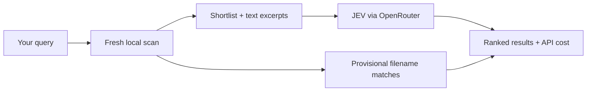

<p align="center">
  
</p>

# JEV Search

A small macOS menu bar app for finding files in your own words. Powered by JEV, with a Python core and an Electron UI.

**No pre-indexing. Every search scans your files fresh.**

- Search filenames and text from PDFs, documents, and code.
- See results, file previews, and API cost as they arrive.
- Use **Look wider** when you need a broader search.

## Quick start

Requires **macOS**, **Python 3.12+**, and **Node.js 22+**.

```sh
git clone https://github.com/assadiandre/jev-search.git
cd jev-search

python3.12 -m venv .venv
.venv/bin/python -m pip install -r requirements-lock.txt
npm ci
npm start
```

Add your OpenRouter API key in **Settings** to enable semantic search. Your account needs access to `~typesafe/jev-latest`. Without a key, local filename search works offline.

## How it uses JEV

Python scans your chosen folder and shortlists candidates using filenames, paths, and sampled text. It sends batches of candidates with your query to **JEV through OpenRouter**, which scores how relevant each entry is. The app uses those scores to filter and rank results.



Fast search sends up to **128 candidates** to JEV. Local matches can appear while it works; JEV's decisions can then confirm or remove them. **Look wider** runs a broader pass with additional API cost. No index is built or saved. [Search details →](docs/search.md)

## Build

```sh
npm run build
```

Creates `JEV SEARCH.app` in the project folder, with Python bundled. Builds are locally signed, not notarized for distribution.

## Privacy

Semantic searches send your query, relative file paths, and sampled text to OpenRouter/TypeSafe. API keys are encrypted using macOS Keychain. No search index or history is saved.

Common credential files are excluded and common token patterns are redacted, but this is a best-effort filter. Only search folders you are comfortable sending excerpts from.

## Development

```sh
npm test                 # Python and cost tests
npm run test:renderer    # UI and keyboard behavior
npm run test:window      # Native window behavior
```

The code lives in `backend/` (search), `electron/` (desktop integration), and `ui/` (interface).

Issues and pull requests are welcome. Use synthetic files for bug reports and run the relevant tests before submitting changes. See [the search roadmap](SEARCH_PLAN.md) for planned work.
