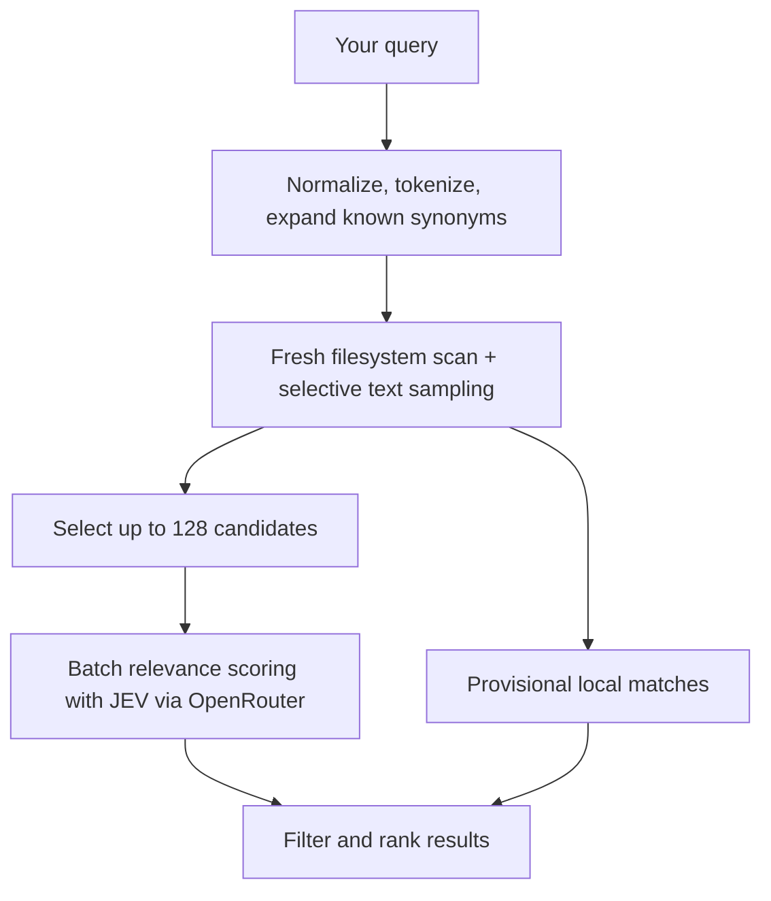

<p align="center">
  
</p>

# JEV Search

Find files in your own words with **JEV**. JEV Search uses the model to judge which files match your query, based on their names, paths, and text excerpts.

**No pre-indexing. Every search scans your files fresh.**

- Search filenames and text from PDFs, documents, and code.
- See results, file previews, and API cost as they arrive.
- Use **Look wider** when you need a broader search.

## Search algorithm

JEV scores file relevance. Local retrieval first narrows a fresh filesystem scan into a small set of candidates, keeping model calls bounded.



1. **Prepare locally.** Normalize the query, split it into words, remove filler words, and expand known synonyms. JEV is not called at this stage.
2. **Scan and shortlist.** Walk the filesystem fresh and sample text. Combine name, content, and context matches with directory diversity and exploration.
3. **Score with JEV.** Send the query and candidates in batches through OpenRouter. Scanning and scoring overlap; local matches can appear immediately.
4. **Rank results.** JEV filters out scores below **0.6** and ranks accepted matches. API cost updates as responses arrive.

**Fast mode** limits JEV evaluation to **128 candidates** for lower latency and cost. **Full JEV mode**, available through **Look wider**, runs a fresh pass that evaluates every eligible entry with JEV using richer sampled excerpts. It takes longer and costs more; file contents are still sampled. Neither mode builds a persistent index.

[Search limits and content coverage →](docs/search.md)

## Quick start

Requires **macOS**, **Python 3.12+**, and **Node.js 22+**.

```sh
git clone https://github.com/assadiandre/jev-search.git
cd jev-search

python3.12 -m venv .venv
.venv/bin/python -m pip install -r requirements-lock.txt
npm ci
npm start
```

Add your OpenRouter API key in **Settings** to enable semantic search. Your account needs access to `~typesafe/jev-latest`. Without a key, local filename search works offline.

## Build

```sh
npm run build
```

Creates `JEV SEARCH.app` in the project folder, with Python bundled. Builds are locally signed, not notarized for distribution.

## Privacy

Semantic searches send your query, relative file paths, and sampled text to OpenRouter/TypeSafe. API keys are encrypted using macOS Keychain. No search index or history is saved.

Common credential files are excluded and common token patterns are redacted, but this is a best-effort filter. Only search folders you are comfortable sending excerpts from.

## Development

```sh
npm test                 # Python and cost tests
npm run test:renderer    # UI and keyboard behavior
npm run test:window      # Native window behavior
```

Issues and pull requests are welcome. Use synthetic files for bug reports and run the relevant tests before submitting changes. See [the search roadmap](SEARCH_PLAN.md) for planned work.

Implementation: Python search core in `backend/`, with a small Electron shell in `electron/` and interface in `ui/`.
